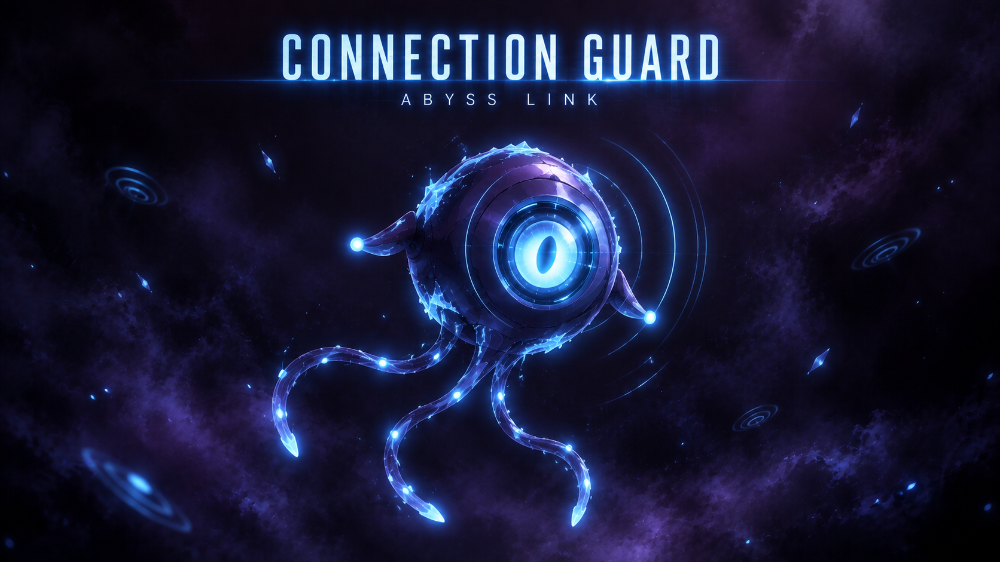

<p align="center">
  
  
  
  
  
</p>

# 🛡️ Connection Guard: Abyss Link

Módulo para Foundry VTT que mostra a latência de cada jogador na mesa, avisa antes de uma queda de conexão e ajuda o GM a configurar a rota de acesso (VPN, tunnel, LAN etc.) sem precisar editar JSON.

[Instalação](#instalação) · [Recursos](#recursos) · [Como usar](#como-usar) · [Configurações](#configurações) · [Arquitetura](#arquitetura) · [FAQ](#faq)

<p align="center">
  
</p>

---

## Por que esse módulo existe

O Foundry é cliente-servidor: cada jogador fala com o servidor por WebSocket, e ponto. Não existe P2P, não existe "otimizar a internet de todo mundo" isso está fora do alcance de qualquer módulo. O que dá pra fazer, dentro dessa arquitetura, é:

| Problema                                           | O que o módulo faz                                                                    |
| :------------------------------------------------- | :------------------------------------------------------------------------------------ |
| Ninguém sabe a latência de ninguém                 | Mede RTT por cliente e mostra na lista de jogadores                                   |
| A queda pega todo mundo de surpresa                | Detecta RTT alto por N ciclos seguidos e avisa antes da queda acontecer               |
| Reconexão lenta do Foundry                         | Backoff do Socket.IO ajustado pra tentar de novo mais rápido                          |
| Medição de latência é sempre no mesmo intervalo    | Intervalo adaptativo: mede mais quando a conexão está ruim, menos quando está estável |
| GM não tem visibilidade do que aconteceu na sessão | Painel de diagnóstico + journal exportável com o histórico completo                   |

É só isso que dá pra prometer dentro da arquitetura do Foundry o resto seria vender fumaça.

---

## Recursos

**Latência em tempo real** badge ao lado de cada jogador (e do GM), com verde/amarelo/vermelho por faixa de RTT. Modo compacto (`+`/`-`/`!`) pra quem não quer números na tela. Tooltip com jitter e perda estimada.

**Reconexão preditiva** o módulo não espera a queda acontecer. Se o RTT sobe acima do limiar por N ciclos consecutivos, ele avisa antes, e reconecta mais rápido que o padrão do Foundry quando a queda vem mesmo.

**Ping adaptativo** mede com mais frequência quando a conexão está degradando, e relaxa quando está estável. Menos overhead no dia a dia, mais resolução no momento em que importa.

**Assistente de rota (GM)** um wizard guiado pra escolher e configurar o serviço de conexão da mesa: Radmin VPN, playit.gg, ngrok, Cloudflare Tunnel, LAN, IP direto ou algo customizado. Sem editar `module.json`, sem abrir console.

**World Gate (GM)** um botão nos **Scene Controls** (paleta lateral padrão do Foundry) para **abrir/fechar a mesa**. Fechado, jogadores não conseguem entrar (bloqueio nativo por role `NONE` no servidor) e quem já estava conectado recebe um overlay de "conexão fechada" e é redirecionado ao login. Útil pra trancar a mesa antes da sessão ou durante um intervalo.

**Painel de diagnóstico (GM)** tabela com latência, jitter, perda e status por jogador, mais o histórico de quedas com timestamp e duração.

**Journal de testes** captura eventos de runtime (lifecycle, conexão, degradação, rotas, erros) e exporta tudo como uma Journal Entry em Markdown, pra quem quiser auditar se o módulo está fazendo o que devia.

**Tema Abyss Link** visual dark/neon com gradientes e pulse, aplicado nos badges, banners e painéis quando o GM ativa pra mesa toda.

---

## Instalação

**Via manifesto (recomendado)**

1. Em **Configurar Jogo → Gerenciar Módulos → Instalar Módulo**, cole:
   ```
   https://github.com/SoftMissT/foundry-vtt-connection-guard/releases/latest/download/module.json
   ```
2. Instalar → ativar em **Gerenciar Módulos**.

**Manual**

1. Baixe o `.zip` da [última release](https://github.com/SoftMissT/foundry-vtt-connection-guard/releases/latest).
2. Extraia para `<seu dataPath>/Data/modules/connection-guard/`.
3. Ative em **Gerenciar Módulos**.

---

## Como usar

### Latência

O badge aparece automaticamente ao lado do nome de cada usuário na lista de jogadores.

| Indicador |    RTT     | Significado  |
| :-------: | :--------: | :----------- |
|    🟢     |  ≤ 100 ms  | Bom          |
|    🟡     | 100–250 ms | Regular      |
|    🔴     |  ≥ 250 ms  | Ruim         |
|    ⚠️     |            | Sem resposta |

### Configurar a rota da mesa

_Apenas GM_ **Configurar Jogo → Configurações → Connection Guard → Configurar Serviço**

1. Escolha o serviço: Radmin VPN Free, playit.gg, ngrok, Cloudflare Tunnel, LAN, IP direto ou customizado.
2. Preencha os dados pedidos.
3. Salvar e ativar rota.

O módulo grava o serviço escolhido como rota ativa e avisa os jogadores com um chip central na tela.

### Abrir/fechar a mesa (World Gate)

_Apenas GM_ O Connection Guard adiciona um botão na paleta de **Scene Controls** (à esquerda da tela, ícone de escudo):

1. **Fechar conexão**: bloqueia a entrada de novos jogadores (role `NONE`) e expulsa quem está dentro (overlay + redirecionamento ao login).
2. **Abrir conexão**: restaura as permissões dos jogadores e libera a entrada novamente.

> Nota: o gate é a camada de permissão de entrada — ele **não** desliga túneis/VPN. Mesmo com o gate fechado, o servidor continua no ar; a diferença é que o login de players passa a ser rejeitado. GM e Assistentes nunca são bloqueados.

### Exportar o journal de testes

**Configurações → Connection Guard → Painel de Diagnóstico (GM) → Exportar Journal**

Isso cria (ou atualiza) uma Journal Entry com o histórico completo em Markdown, e já abre pra revisão.

---

## Configurações

Tudo em **Configurar Jogo → Configurações → Connection Guard**.

| Setting                        | Escopo  | Padrão  | O que faz                                      |
| :----------------------------- | :-----: | :-----: | :--------------------------------------------- |
| Intervalo de medição           |  Mundo  |  `20s`  | Frequência da medição de latência por cliente  |
| Ocultar latência               | Cliente |  `off`  | Esconde o badge na lista de jogadores          |
| Modo compacto                  | Cliente |  `off`  | `+`/`-`/`!` no lugar do valor em ms            |
| Tooltip de diagnóstico         | Cliente |  `on`   | Jitter e perda no hover do badge               |
| Reconexão agressiva            | Cliente |  `on`   | Backoff mais curto + reconexão forçada         |
| Atraso máximo entre tentativas | Cliente |  `15s`  | Teto do backoff exponencial                    |
| Histórico de quedas            |  Mundo  |  `30`   | Quantas quedas o painel do GM guarda           |
| Limiar de degradação           |  Mundo  | `300ms` | RTT acima disso liga o monitoramento preditivo |
| Ciclos para alerta             |  Mundo  |   `3`   | Ciclos consecutivos antes de disparar o alerta |

---

## Arquitetura

```
connection-guard/
├── scripts/
│   ├── main.js                 # Entry point, hooks init/ready
│   ├── constants.js            # IDs, eventos, defaults, tipos e serviços
│   ├── settings.js             # Registro de settings e menus
│   ├── latency-monitor.js      # RTT, jitter, perda, adaptive + preditiva
│   ├── diagnostics.js          # Estado em memória: por usuário + quedas
│   ├── reconnect-manager.js    # Backoff Socket.IO + reconexão forçada + banner
│   ├── active-route-chip.js    # Chip de rota ativa (auto-dismiss 15s)
│   ├── player-list-ui.js       # Badge de latência na lista de jogadores
│   ├── gm-panel.js             # Painel do GM (DialogV2) + exportar journal
│   ├── service-wizard.js       # Wizard de escolha/configuração de serviço
│   ├── route-wizard.js         # Scanner de rotas (Route Oracle)
│   ├── route-profiles.js       # CRUD de perfis de rota + rota ativa
│   ├── route-scanner.js        # Scanner HTTP de disponibilidade
│   ├── route-score.js          # Scoring de qualidade de rota
│   ├── world-gate.js           # World Gate: abrir/fechar a mesa (GM)
│   └── journal-logger.js       # Captura de eventos → Markdown → Journal Entry
├── styles/connection-guard.css # Badges, banner, painel, tema Abyss Link
├── lang/
│   ├── pt-BR.json
│   └── en.json
├── module.json
└── CHANGELOG.md
```

Sem etapa de build: ES Modules puro, carregado direto pelo Foundry via `esmodules`.

### Fluxo de dados

```
Cliente ──game.time.sync()──► LatencyMonitor (RTT/jitter)
   ▲                                 │
   └──────Socket.IO emit─────────────┤
                                      ├──► PlayerListUI (badge)
                                      ├──► DiagnosticsStore (estado + quedas)
                                      ├──► ReconnectManager (backoff/reconexão)
                                      └──► JournalLogger (export Markdown)
```

---

## Serviços suportados

| Serviço           |     Tipo     | Requer VPN |
| :---------------- | :----------: | :--------: |
| Radmin VPN Free   |   `radmin`   |    Sim     |
| playit.gg         |   `playit`   |    Não     |
| ngrok             |   `ngrok`    |    Não     |
| Cloudflare Tunnel | `cloudflare` |    Não     |
| LAN               |   `local`    |    Não     |
| IP direto         |   `direct`   |    Não     |
| Customizado       |   `custom`   |    Não     |

Quando uma rota falha, o módulo mostra dicas específicas pro serviço em uso "Radmin conectado no mesmo grupo?", "túnel do playit ativo?".

---

## Radmin Fallback Readiness (guia genérico)

O fallback de emergência funciona assim:

```text
PRIMARY   →  Cloudflare OU ngrok OU playit.gg
FALLBACK  →  Radmin VPN (rota configurada pelo GM)
```

Para depender do fallback numa sessão, cada cliente precisa alcançar o host
Radmin VPN configurado. O Connection Guard **não instala Radmin, não altera o
firewall do sistema nem pede privilégio administrativo** — ele apenas orienta
e gera o comando copiável.

Pré-requisitos do Radmin:

1. **Radmin VPN instalado no host** do Foundry.
2. **Host conectado à rede Radmin** (mesmo grupo de todos).
3. **Jogadores conectados à mesma rede Radmin**.
4. **Porta do Foundry liberada no firewall** — use o botão "Copy Host Firewall
   Command" no Assistente de conexão para gerar a regra `New-NetFirewallRule`
   com a porta já configurada e cole no PowerShell do host (como administrador).
5. **Rota Radmin testada por pelo menos um cliente** — use "Open Radmin Test"
   para abrir a rota numa aba nova e confirmar manualmente que o Foundry
   responde pelo Radmin.

O assistente mostra um checklist "Radmin Fallback Readiness" com esses passos.
Enquanto o fallback não for validado, o status é **Radmin Fallback — Not
Verified** (aviso, não bloqueio). Use "Mark as Verified" após confirmar a rota.

> O fallback automático exige que cada cliente tenha acesso de rede ao host
> Radmin VPN configurado. O Connection Guard não pode configurar o Radmin VPN
> nem as regras de firewall do sistema operacional automaticamente.

---

## FAQ

**O módulo funciona com qualquer sistema?**
Sim. Ele opera na camada de rede do Foundry e não toca em dados de Actor, Item ou sistema. D&D 5e, Pathfinder 2e, Call of Cthulhu, homebrew tanto faz.

**Precisa de outro módulo como dependência?**
Não, é standalone.

**Ele configura voz/vídeo?**
Não. STUN/TURN foi removido a partir da v3.1.0 se a mesa usa Discord pra voz, o Discord já resolve isso melhor do que qualquer módulo de VTT conseguiria.

**Os jogadores veem o mesmo que o GM?**
Os badges, o chip de rota e o tema são sincronizados pra todos via settings de mundo. O que só o GM vê é o painel de diagnóstico, o wizard de serviço e o controle da rota ativa.

**O chip de rota atrapalha a rolagem de dados?**
Não deveria ele aparece centralizado, some em 15s com uma animação suave, e também pode ser fechado no ×.

---

## Contribuindo

1. Fork
2. `git checkout -b feature/nome-da-feature`
3. `npm install`
4. Altere e rode `npm run lint`
5. `git commit -m "feat: descrição"`
6. `git push origin feature/nome-da-feature`
7. Abra o PR

```bash
npm run lint        # ESLint
npm run lint:fix    # ESLint com auto-fix
npm run format      # Prettier (scripts, lang, docs)
npm run package     # Monta dist/ e module.zip
npm run release     # lint + package (usado no CI)
```

---

## Compatibilidade

|              |                                                          |
| :----------- | :------------------------------------------------------- |
| Mínimo       | Foundry VTT v13                                          |
| Verificado   | v14.999                                                  |
| Máximo       | Nenhum fixado sem garantia além disso até mudança de API |
| Dependências | Nenhuma                                                  |
| Sistemas     | Todos                                                    |

---

## Créditos e licença

A ideia parte do [`foundry-user-latency`](https://github.com/mawburn/foundry-user-latency), de **mawburn** a técnica de medição via `game.time.sync()` vem de lá. O código em si foi reescrito do zero em ES Modules pra v13+, com reconexão preditiva, ping adaptativo, configuração guiada de rotas e journal de testes adicionados por cima.

Criado por [**SoftMissT**](https://github.com/SoftMissT). Licenciado sob **GPL-3.0** use, modifique e distribua livremente.

---

<sub>Feito para a comunidade Foundry VTT brasileira.</sub>
[🐛 Reportar Bug](https://github.com/SoftMissT/foundry-vtt-connection-guard/issues) · [💡 Sugerir Feature](https://github.com/SoftMissT/foundry-vtt-connection-guard/issues) · [📦 Releases](https://github.com/SoftMissT/foundry-vtt-connection-guard/releases)
